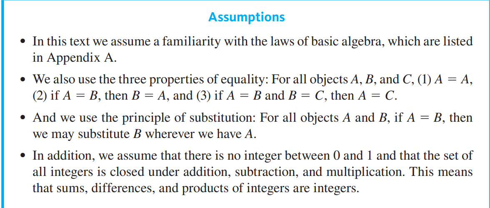
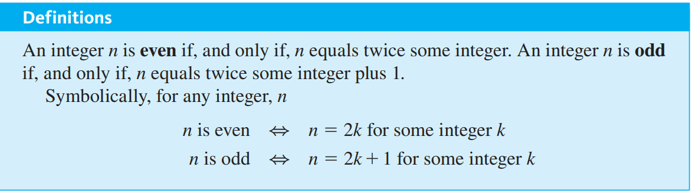
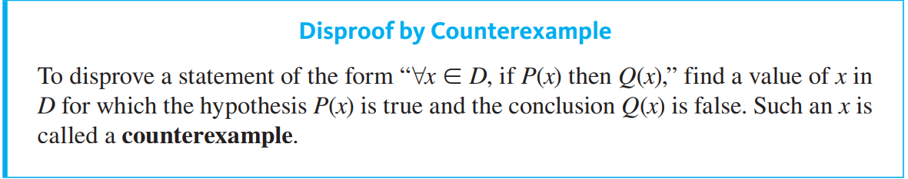
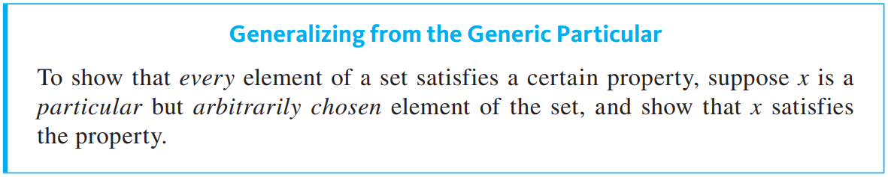
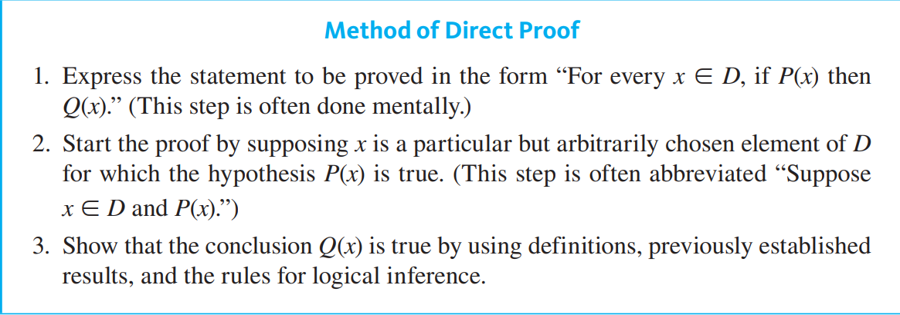

2022-10-31 | 19:27
Status: #coursenote 

Class: [[CPSC121 Index|CPSC121]]
Subject: [[000 Symbolic Logic|Logic]]
Topics: [[Quantified Statements]] [[Universal Instantiation]]

# Direct Proofs

## Assumptions

## Odd vs. Even

- sometimes the only-if part is omitted, but must be retained in memory and in formal proofs

## Prime vs. Composite

# Proofs of Existence
- Using existential quantifier, proving that a statement in a given form is true
- e.g. $\exists x \in D, Q(x)$
### Constructive
- Can be done by:
	- finding an x
	- giving a set of directions for finding an x
- The logical principle behind this proof is called the **existential generalization**
	- *if you know that a certain property is true for a given object, then you may conclude that there exists an object fro which that property is true*

### Nonconstructive
- Can be done by:
	- proving that the value that makes the statement true is guaranteed by an axiom or previously proved theorem
	- the assumption that there is no x leads to a contradiction
- Disadvantage is that it gives no clue about where or how x may be found

# Proofs of Universality
### Disproving Universal Statements by Counter Example

- Only one counter example is needed to disprove

### Proving Universal Statements (Direct Proof)
- $\forall x \in D, P(x) \implies Q(x)$
- If D is finite, or a finite number of elements satisfy P(x), a statement can be proved by **method of exauhstion**
- In most mathematical situations, the method of exahstion cannot be used (infninite sets or very long finite range)
- **Universal generalization**
	- Generalizing from the generic particular
	- 
- x holds no exact value, rather it is a particular representation of any arbitrary element of the set
	- The point is to make an x be generic is to make a proof generalized to all elements of the domain
	- *You are making **no special assumptions** about x*
		- x shares all characteristics of the group or class
- Result of generalizing from the generic particular applied to a universal conditional is the **direct proof**
	- If you can show that P(x) compels the truth of Q(x), then the statement will have been proven
		- statement can only be false if P(x) is true and Q(x) is false)

- this is basically arguments all over again. the validity, now the "proof", is the outcome of rules of inference on various statements

extra steps
- form a starting point (usually the hypothesis of the conditional)
- form an ending point, the conclusion

notes on proving even/odd
- usually prove that your end result is 2 * (terms) and then replacing the terms by a variable

## Ending Proofs
- "This is what we needed to show"
- "As was to be shown"
- "Q.E.D."
	- quod erat demonstrandum
- "Therefore, ...."

## Proof Tips
- Assumption is the hypothesis of the conditional
- These are premises, but called assumptions
- Although an arbitrary value must be used for $\forall$, a specific, chosen value can be used for $\exists$
	- e.g. "Choose m = 7 * n" (where n is a $\forall$ arbitrary value)
- DO NOT begin by assuming the conclusion
	- although you *do* assume the opposite of the conclusion in the contrapositive proof
- Begin proof with "Consider integer x" or "Consider an element in the universal set" or "Consider a set in the set of all possible sets"
	- Then after, make assumptions on set/element/integer
- If you want to bring in a new variable, just state your equation with the variable, then say **for some $a \in Z$**
- When hitting a roadblock in a proof, either prove contrapositive/contradiction or do a proof by cases, by splitting up your proof into diff. possibilities
- When trying to choose values for existential values within a direct proof, one can make various test cases on what results would result in the answer found
- When dealing with all integers, it is easier to prove by divding into cases
- If the conclusion has an or statement, consider using a proof by contrapositive to have a bunch of good assumptions. Same for if the hypothesis has an if statement
	- One can also consider proof by contradiction
- There's no representation in integer form of irrational numbers, so one must deal with rationals and manipulate them to prove a point
- If a n isn't divisible by m, then it's equal to either n\*m + 1 or n\*m + 2 ... n\*m + m-1
	- definition of **remainder**?
- Without loss of generality indicates that you are proving one case because all others are nearly identical
- Split up in cases only when you can't find another equation for your variables
	- e.g. if you can divide, don't split up, since a|b means b = m * a
- Choose contrapositive or direct for simplest transformation
	- e.g. squaring is simplier than square rooting

## Example Proof

## Identifying the Starting Point and the Conclusion to be Shown
- Write the first sentence of a proof (the starting point) and the last sentence (the "conclusion to be shown")

****
## Relevant Links

