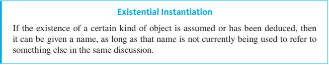

2022-10-31 | 21:06
Status: #coursenote 

Class: [[CPSC121 Index|CPSC121]]
Subject: [[000 Symbolic Logic|Logic]]
Topics: [[Quantified Statements]]

# Existential Instantiation

## Existential Instantiation
- ?>?
- if something exists, you can give it a name
	- you cannot use the same name to refer to two different things
- All variable names are within the scope of the argument

****
## Relevant Links

