2022-10-10 | 18:07
Status: #coursenote 

Class: [[CPSC121 Index|CPSC121]]
Subject: [[000 Symbolic Logic|Logic]]
Topics: [[]]

# Predicates and Quantified Statements
- Different from statemnts and propositions
- Called **predicate calculus** (as opposed to statement/propositional calc)
- (Grammar) Predicates are the part of a sentence that give information about a subject
- In logic, predicates can be obtained by removing some/all of the nouns from a statement
- Nouns are replaced with predicate variables
- When **concrete** **values** are substituted in place of predicate variables, a **statement** results
- Quantified means that the statements hold for some quantified number of things

##### Definition
- A **predicate** is a predicate symbol togbether with suitable predicate variables
	- can be called **propositional functions** or **open sentences**

##### Example
James is a student at Bedford College
- let P stand for "is a student at Bedford College"
- let Q stand for "is a student at"
- Both P and Q are **predicate symbols**

- P(x) = x is a student at Bedford College
- Q(x, y) = x is a student at y

## Truth Set
- The set of all elements that make the predicate true
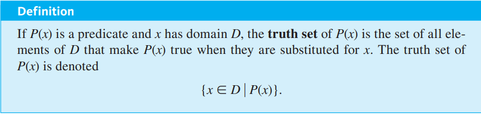
- The set of all x in D such that P(x)

##### Example
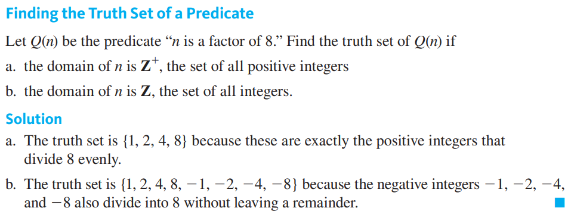

## Quantifiers
- One way to change predicates into statements is to assign specific values to all their variables (as we know)
- Another way is to add **quantifiers**
	- are words that refer to quantities such as "some" or "all"
	- tell for how many elements in a given predicate is true
- In informal language, the quantifier may be placed at the end of the sentence
	- The quantifier is said to *trail* the rest of the sentence
- Quantifiers will always have both a variable and a domain attached to it

#### Universal Quantifier ($\forall$)
- Depending on context:
- **for every** or **for each** or **for any** or **given any** or **for all**
- The domain of the predicate variable is generall indicated between the $\forall$ symbol and the variable name ($\forall$ human being x) or immediately following the variable name 
  ($\forall x \in H$)
- $\forall$ can refer to two or more variables
	- *e.g. For all real numbers x and y, x+y = y+x.*
		- $\forall$ real numbesr x and y, x + y = y +x
- Sentences that are quantified universally are defined as statements by giving them the truth values specified in this definition:
	- 
- Testing every element of the domain for the truth of the predicate is called **method of exaustion**
	- can be used whenever the domain of the predicate variable is finite

**Example**
- *e.g. Every human being is mortal* or *All human beings are mortal*
	- $\forall$ human beings x, x is mortal
	- For every human being x, x is mortal
	- *if H is the set of all human beings:*
	- $\forall x \in H, x$ is mortal
		- x is an **individual** but generic object, with every property shared by all humans but none more
	- **For all x in H, x *is* mortal**

#### Existential Quantifier ($\exists$)
- **There exists**
	- or *there is a* or *we can find a* or *there is at least one* or *for some* or *for at least one*
- The domain of the predicate variable is indicated either:
	- between the existential symbol and the variable name
	- immediately following the variable name
		- the words *such that* are inserted before the predicate
- Can be used to refer to two predicate variables
	- $\exists$ integers *m* and *n* syuch that m + n = m * n
- Defined as statements by giving them the truth values in the following definition
	- 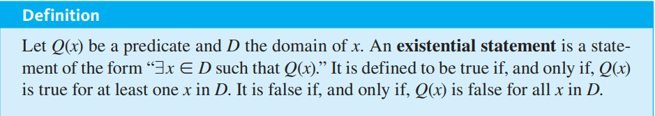
- Basically the opposite of the universal quantifier (super easy to prove true)
- Something being existentially quantified means it has a definite value
- If statements with the universal quantifier are useless
	- 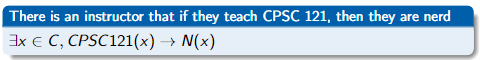
	- there need not be an instructor that teaches CPSC121

**Example**
- There is a student in Math 140
- $\exists$ a person *p* such that *p* is a student in Math 140
- $\exists p \in P$ such that *p* is a student in Math 140
	- There exists a person in the set of all people such that p is a student in Math 140

## Equivalent Forms of Universal and Existential Statements
##### Easy Example
- “$\forall$ real number x, if x is an integer then x is rational” and “$\forall$ integer x, x is rational” are equivalent
	- The set of integers is a subset of the set of real numbers
	- Both have informal translations: All integers are rational

##### Universal Equivalent Forms
- $\forall x \in U, P(x) \implies Q(x)$
	- can be rewritten as
	- $\forall x \in D, Q(x)$
		- Where D is the subset of U that makes P true

- $\forall x \in D, Q(x)$
	- $\forall x, x \in D \implies Q(x)$

##### Existential Equivalent Forms
- $\exists x$ such that P(x) and Q(x)
	- $\exists x \in D$ such that Q(x)
		- Where D is the subset of all x for which P is true

## Negation of Quantified Statements
#### Negation of a Universal Statement
- The negation of a universal quantifier (for all) is logically equivalent to an existential statement (there's at least one that isn't)
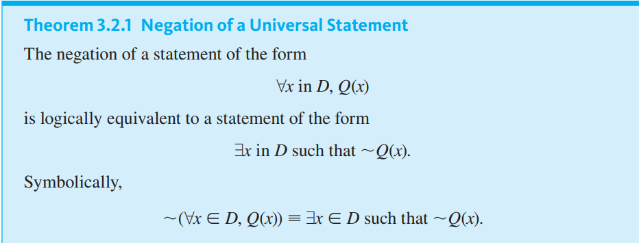

#### Negation of an Existential Statement
- The negation of an existential quantifier (there is one) is logically equivalent to a universal statement (none are)
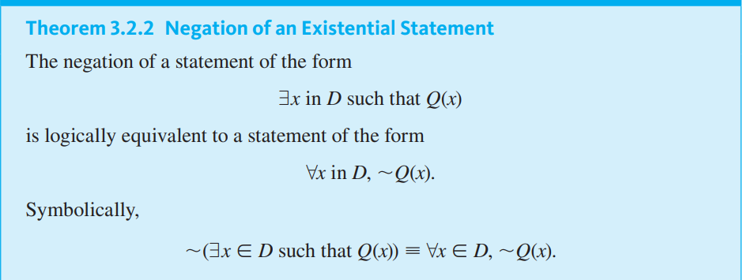

## Relationship between Quantifiers and AND, OR
- Negation of a for all statement is a there exists statement... negation of a there exists statement is a for all statement....
	- Similar to and and or
- **Universal** statements are generalizations of **and** statements
- **Existential** statements are generalizations of **or** statements

## Logical Equivalence for Quantified Statements
- The statements always have identical truth values no matter what predicates are substituted for the predicate symbols (e.g. Q(x) replaced with x is a Quarter) and no matter what sets are used for the domains of the predicate variables

## Vacuous Truth of Universal Statements
- **A statement is false if and only if its negation is true**
- If its negation is false, then the statement is, by default, true
- *If you have a collection of blue balls and grey balls, if no balls are in a bowl, then the statement "All the balls in the bowl are blue" is true, because there does not exist "A ball in the bowl that is not blue", yet that is the negation*
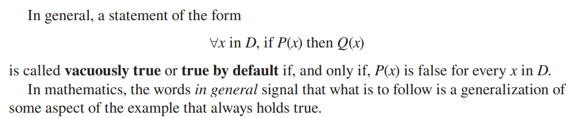
- **In general means that something is always true**

## Universal Conditional Statements
- Most important form of statement in mathematics
- $\forall x, P(x) \implies Q(x)$
- For all x, if P(x), then Q(x)
- It is common to omit explicit identification of the domain of predicate variables
- Note that the truth table for if-then statements still holds
- That is, a statement is true any time Q(x) is true, or if P(x) and Q(x) are both false
	- if an if statement has a false hypothesis,. we interpret it as true regardless of whether its conclusion is true or false
- Note that the definition of a valid argument is a universal conditional statement:
	- For every combination of truth values for the component statements, if the premises are all true then the conclusion is also true.

#### Negation of a Universal Conditional Statement
- The negation of a normal if/then statement, plus the negation of the quantifier
- $\neg P \implies Q\equiv P \land \neg Q$

#### Variants Extended from Conditional Statements

- A universal conditional statement is logically equivalent to its contrapositive
	- 
- However, it is not logically equivalent to its converse or its inverse

## Necessary and Sufficient Conditions, Only If

##### Example

## Bound Variables and Scope
- A variable is bound to the predicate that it is defined in, like computer programming
- It is also bound to the parantheses it is defined in
- An unbound variable is not within the scope of a quantifier and the truth value can not be determined
	- note that a predicate may contain ubnound variables but a proposition cannot

## Implicit Quantification
- A statement may not have a quantifier, and it may be implied
	- the word a can be used in place of a universal quantifier
	- the words can be can be used in place of an existential quantifier
- A statement may not have a quantifier or a domain, but instaed have them implied through what is normal
- A double arrow is used to indicate implicit quantification symbolically

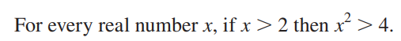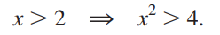

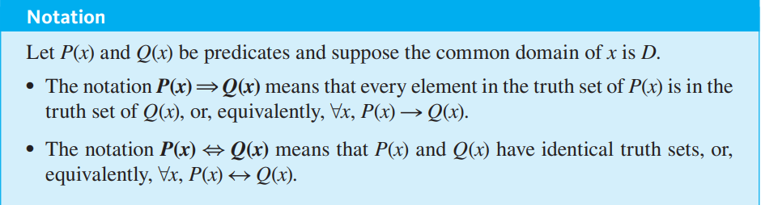

## Tarski's World
- A simple program made for testing your skills in logic. A grid populated with coloured shapes that can be compared to one another. 
**example:

## Multiple Quantifiers
- Multiple quantifiers and the actions imposed onto them are read in the order that they are given
- The first

##### Example
$\exists x \in D | \forall y \in E$, x and y satisfy P(x, y)
- There exists a triangle such that all squares are the same colour as it
- There exists a triangle that is the same colour as every square
- **x has to work with any y, *you cannot change x after you define it***
$\forall x \in D | \exists y \in E$, x and y satisfy P(x, y)
- For every triangle, there exists a square that has the same colour as it
- No matter what triangle you have, there exists a square with the same colour as it
- **every x has to work with any y, you cannot leave out any xs**

#### Negation of Statements with Multiple Quantifiers
- As mentionned earlier, quantifiers are read in order, so they are negated in order
	- $\neg (\forall x \in D, \exists y \in E | P(x, y) )$
	- $\exists x \in D, \neg(\exists y \in E | P(x, y))$
	- etc.

#### Order of Quantifiers
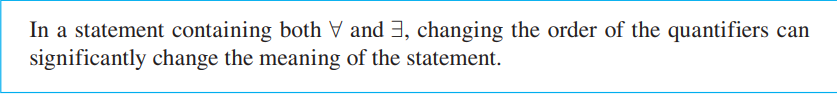
- Quantifiers, or quantifiers and their statements (quantified variables)

- Everyone loves someone
- Someone is loved by everyone

- However, if two quantifiers of the same type follow each other, they can be interchanged and even combined

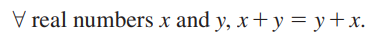

## Formal Logic Notation

****
## Relevant Links

