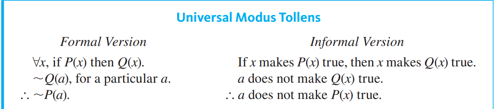
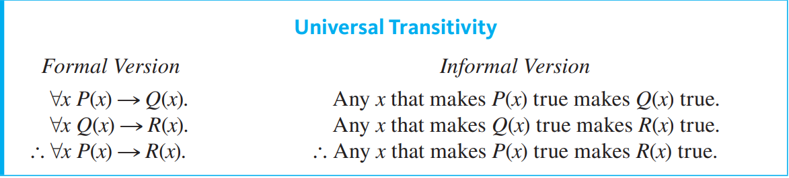
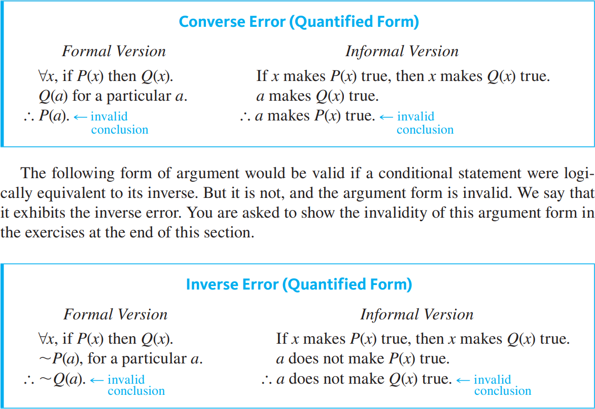

2022-10-24 | 22:52
Status: #coursenote 

Class: [[CPSC121 Index|CPSC121]]
Subject: [[000 Symbolic Logic|Logic]]
Topics: [[Quantified Statements]]

# Universal Instantiation
- Turning compound statements into predicates, basically. Quantification of satements.
	- quantification being quantifying the number of applications the statement applies to

## Types of Universal Instantiation
- Conditional
- mod. ponens and tollens
- universal transitivity

## Quantified Error

## Abduction
- Basically practically applied converse error. Strong assumptions based off of invalid arguments
	- e.g. x has loud wet cough and painful lungs, so x could very well have pneumonia
		- if x has pneumonia, x has a loud wet cough

## Argument with 'no'
- no polynomial functions have horizontal asymptotes
- equivalent to, for all x, if x is a funciton with a horizontal asymptote, it is not a polynomial

****
## Relevant Links

