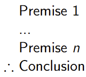
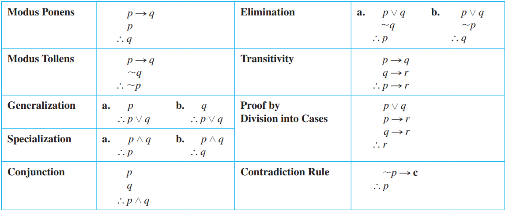

2022-10-04 | 12:42
Status: #coursenote 

Class: [[CPSC121 Index|CPSC121]]
Subject: [[000 Symbolic Logic|Logic]]
Topics: [[Complex Logic]]

# Conditional Proofs
- Usually used to convince ppl of the truth of a conditional proposition, given the truth of the premises
- Proving a relation between premises and conclusion, nothing about the premises themselves or the conclusion itself
- If we are told to prove that something is valid, assume that it is valid
- Proof can only prove **validity**, no invalidity
	- since contradictions exist
	- contradictions are valid too
- To prove invalidity, chose a combination of T and F to make conclusion false and premises true

##### Propositional Logic Proofs
- Use rules to create new premises to try to get to conclusion
- One rule at a time
- Use [[100 Knowledge/Computer Science/Logic/Symbolic Logic/Validity/Validity of Arguments#Rules of Inference|Rules of Inference]]

## Steps
1. Copy **only** premises 
	- NOT conclusion
2. Number them
3. When creating a new premise, say the rule and the premises used with the rule
	- keep numbering them
4. Equivalence laws may be used (since its the same truth tables)

****
## Relevant Links

