2022-10-03 | 21:15
Status: #coursenote 

Class: [[CPSC121 Index|CPSC121]]
Subject: [[000 Symbolic Logic|Logic]]
Topics: [[Basic Logic]] [[Complex Logic]] [[Conditional Proofs]]

# Validity of Arguments
## Argument
- An argument is not a dispute, it is a sequence of statements ending in a conclusion
- The validity of an argument is whether the conclusion follows *necessarily* from the preceeding stastements'
- An argument form is valid **if, and only if**, whenever statements are subsituted into statement forms that make all the premises true, the conclusion is also true

- Statement form is a bunch of statement variables connected by logical connectives

##### Crucial Information
- The truth of an argument's conclusion follows necessarily from the truth or its premises
	- it's impossible to have a valid argument with all true premises and a false conclusion
- When an argument is valid and its premises are true, the truth of the conclusion is inferred
	- if a conclusion ain't necessarily so, then it isnt a valid deduction
- !! An argument is seen valid **by default**, until proven otherwise
- If $p1 \land p2 \land p3...$ then c is the form of the argument

##### Sound
- An argument is **sound** if, and only if, it is valid *and* all its premises are true
- An argument that is not sound is called **unsound**

##### Property of Argument Forms
- If an argument is valid, then so is every other argument that has the same form (but they aren't necessarily sound)
	- If an argumennt is invalid, then so is every other argument that has the same form
- Basically, what characterizes a valid argument is that no argument whose form is valid can have all true poremises and a false conclusion
	- For each valid argument, there are arguments of that form with
		- all true premises and a true conclusion
		- at least one false premise and a true conclusion
		- at least one false premise and a false conclusion
	- For each invalid argument, there are arguments of that form with every combination of truth values for the premises and conclusion, including all true premises and a false conclusion
- We can only be sure that the conclusion of ana rgument is truwe when we know that the argument is sound
	- the argument is both valid and has all true premises

****
## Testing an Argument Form for Validity
1. Identify the premises and conclusion of the argument form
2. Construcvt a truth table showing truth values of all premises and the conclusion
	- The truth values of the conclusion need only be filled in at the critical rows
3. A row of the truth table where all the premises are true is called a **critical row**
	- If there is a critical row where the conclusion is false, then the argument form is invalid
	- If the conclusion in **every** critical row is true, then the argument form is valid
	- If there are no critical rows, **the argument is vacuously valid**
- A good way to picture the validity of an argument form is to just plug in T for every possible location and just probe around yk

##### Example

- Row with arrow shows that an argument of this form can have true premises and a false conclusion, so this form of argument is invalid

## Proving Invalidity
- One can not prove invalidity through inference
- Need to find a combination of truth values for statement variables to result in premises being true and conclusion false.
- This is the only way
- prove that the values chosen results in all premises being True and conclusion is False

## Proving Contradiction
- Prove conclusion and not conclusion. 
- Two different proofs
	- or one proof for both conc and not conc, generalization and negation

****
## Validity vs. Truth
- If an argument seems valid, one may accept the conclusion as true
	- And if an argument seems invalid, they think the conclusion must be false
- NOT CORRECT!

##### A Valid Argument with a False premise and a False Conclusion
- Valid by modus ponens but its major premise and its conclusion are false
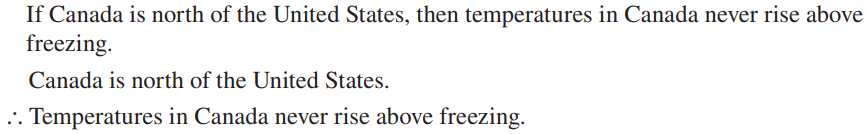

##### An Invalid Argument with True Premises and a True Conclusion
- Invalid by the converse error but it has a true conclusion
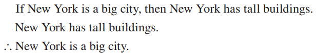

****
## Rules of Inference
- A **rule of inference** is a form of argument that is valid
	- modus ponens and tollens are both rules of inference
- can only show that an argument is valid, not invalid
	- proving the negation of the conclusion does not prove invalidity, only that it may be a contradiction
- Rules of inference are better suited for proving larger theorems, as they show more complex relationships between premises
- Cannot use rules of inference in part of equation

**Summary:**

****
#### Modus Ponens and Tollens
- A **syllogism** is an argument form consisting of two premises and a conclusion
	- The first premise is called the major premise
	- The second premise is called the minor premise

##### Modus Ponens
- The most famous form of syllogism is called **modus ponens**
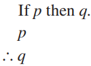
- Modus Ponens means **method of affirming** (the conclusion is an afffirmation)
	- basically, the truth is obvious from the arguments
- It is instructive because it confirms the agreement between the formal definition of validity and the intuitive concept
![[Pasted image 20221003213340.png|400]]
e.g.
![[Pasted image 20221003213134.png|400]]

##### Modus Tollens
- 
- Modus Tollens means **method of denying** (the conclusion is a denial)
- The validity of modus tollens follows from modus ponens and the fact that a conditional statement is logically equivcalent to its contrapositive

e.g.

****
##### Generalization (conjunction)

- Used for making generalizations
- According to a., if p is true, then, more generally, p or q is try for any other statement q

trying to find upperclassmen at a school

##### Specialization
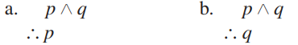
- Used when classifying objects according to some property, youoften know much more about them than that one property
- Used to discard extraneous information
- Simpler than it appears
- You can discard multiple extraneous info at once

trying to find a graph algorithm worker

##### Elimination

- When you have two possibilities and you can rule one out, the other must be the case

![[Pasted image 20221003214341.png|500]]

##### Transitivity
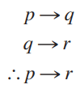
- Chains of if-then statements
- if the first statement implies the second, and the second the third, then the first implies the third
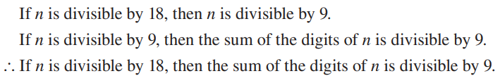

##### Proof by Division into Cases
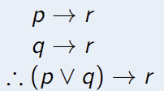
- if both p and q lead to a conclusion, p or q will necessarily lead to that conclusion

##### Resolution
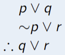

##### Contradiction

****
##### *Example*
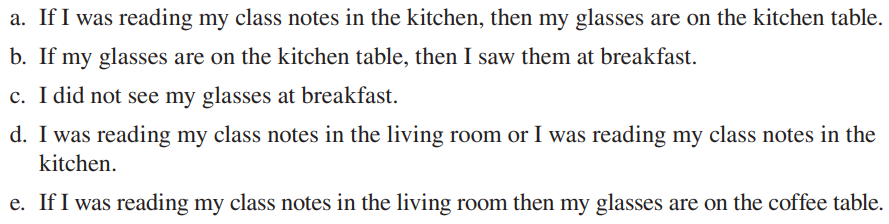
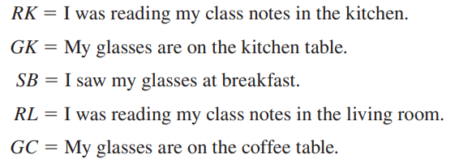

****
## Fallacies
- A fallacy is an error in reasoning that results in an invalid argument
- Three common fallacies:
	- **using ambiguous premises**
		- treating them as if they were unambiguous
	- **circular reasoning**
		- assuming what is proved without having derived it from the premises
	- **jumping to a conclusion**
		- without adequate grounds
	- **converse error** and **inverse error**
		- Give rise to arguments that superficially resemble modus ponens and modus tollens
- **One can find the invalidity of an argument by finding an argument of the same form with true premises and a false conclusion**
	- For an argument to be valid, every argument of the same form whose premises area ll true must have a true conclusion

##### Converse Error

- The fallacy is that the conclusion of the argument would follow from the premises if the premise $p \implies q$ were replaced by its converse
	- such a replacement is not allowed because a conditional statement is not logically equivalent to its converse (only biconditional statements are)
- Known as **fallacy of affirming the consequent**

- The first premise gives information about Zeke *if* it is known he is a cheater
	- if doesn't give information about him if it is not already known that he is a cheater
- A person may not be a cheater but happens to sit in the back row
	- then, first premise is true by default and the second premise is also true but the conlusion is flase

##### Inverse Error
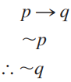
- Inverse error because the conclusion of the the argument would follow if the premise were replaced by its inverse
	- a conditional statement is not logically equivalent to its inverse
	- Inverse error is known as the fallacy of denying the antecedent

****
## Contradictions and Valid Arguments
- A logical contradiction can be used to make inferences through the contradiction rule
- Variation:
	- if an assumption leads to a contradiction, then that assumption must be false
- Arguents are valid until provid invalid
	- if the **argument** is a contradiction, then it is (useless) but valid
	- contradictions mean that both a conclusion and a negatie

- p is some statement whose truth you wish to deduce
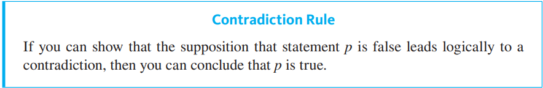 ![[Pasted image 20221003224052.png|400]]
![[Pasted image 20221003224102.png|400]]

##### Knights and Knaves
- island contains:
	- knights who always tell the truth
	- knaves who always lie

- What are A and B?
	- They are both knaves

A is a knave, so...
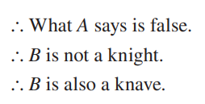

****
## Relevant Links

